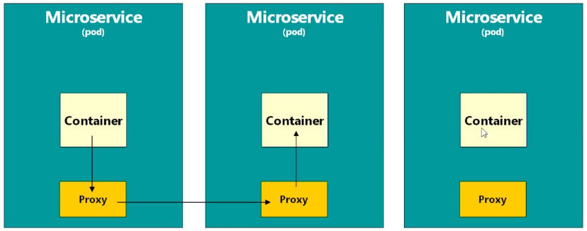
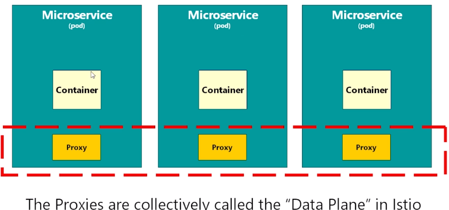

# What is Istio? 
Its a service mesh.<br>

***What is a Service Mesh?***
> An extra layer of software you deploy alongside your cluster(eg Kubernetes) 

> Its not only usable with Kubernetes, we can use it any kind of distributed application.

Istio, handles the PODs communication. All traffic routed to container with Istio.
<br>

***But why we need it?***

> We use Istio to implement cutting concerns like gathering metrics. We need for this information
to trace PODs, monitoring logs and implement some patterns like circuit breker or things with security.

***How Istio do that?***
> Injects a container called Proxy inside PODs. For ex, if one container in POD sends request to
another container, it request routed to Proxy container inside. Its here that Mesh logic implemented
in here. Proxy then routes this request to target PODs Proxy.



***Data Plane***
> Its the name of the collection of running proxies.



***Control Plane***
> The PODs implementing Istio's functionality are collectively called the control plane.
There were a lot of PODs inside the control plane. Istiod, Kiali UI
The core of control plane is one container that we call the istio daemon or istiod

## Running Istio
When we install Istio, it creates namespaces and lots of objects.
<br>
These are the PODs when install we install Istio.
```
grafana-784c89f4cf-bgqlq                1/1     Running   0          3m30s
istio-egressgateway-8dff9c778-f4gl2     1/1     Running   0          3m31s
istio-ingressgateway-6cfd75fc57-lll2l   1/1     Running   0          3m31s
istiod-665965d9c4-x2t9z                 1/1     Running   0          3m31s
jaeger-7f78b6fb65-49st7                 1/1     Running   0          3m30s
kiali-67c67cd9f6-n7rzm                  1/1     Running   0          3m30s
prometheus-7bfddb8dbf-wkqc8             2/2     Running   0          3m31s
```